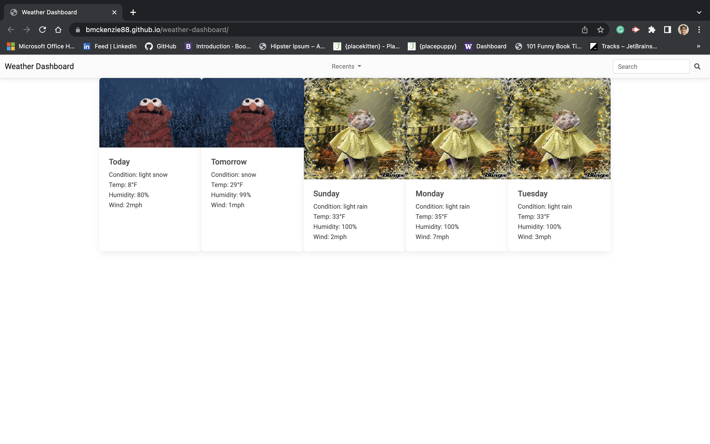

# Weather Dashboard

## Description

This app is a dashboard that provides a 5 day forecast for a given city, using the OpenWeather API.

## Table of Contents

- [Usage](#usage)

- [License](#license)

- [Contributing](#contributing)

- [Questions](#questions)

## Usage

To use the app, simply enter a city in the search bar in the upper right hand corner of the screen and press enter. Recent searches are saved in the "recents" dropdown menu located in the middle of the navbar.

## License

MIT

## Contributing

All contributions are welcome. Please see contact info below.

## Questions

Visit my GitHub proflie - [bmckenzie88](https://github.com/bmckenzie88)

Reach me via email - [brycelmckenzie@gmail.com](mailto:brycelmckenzie@gmail.com)

---
